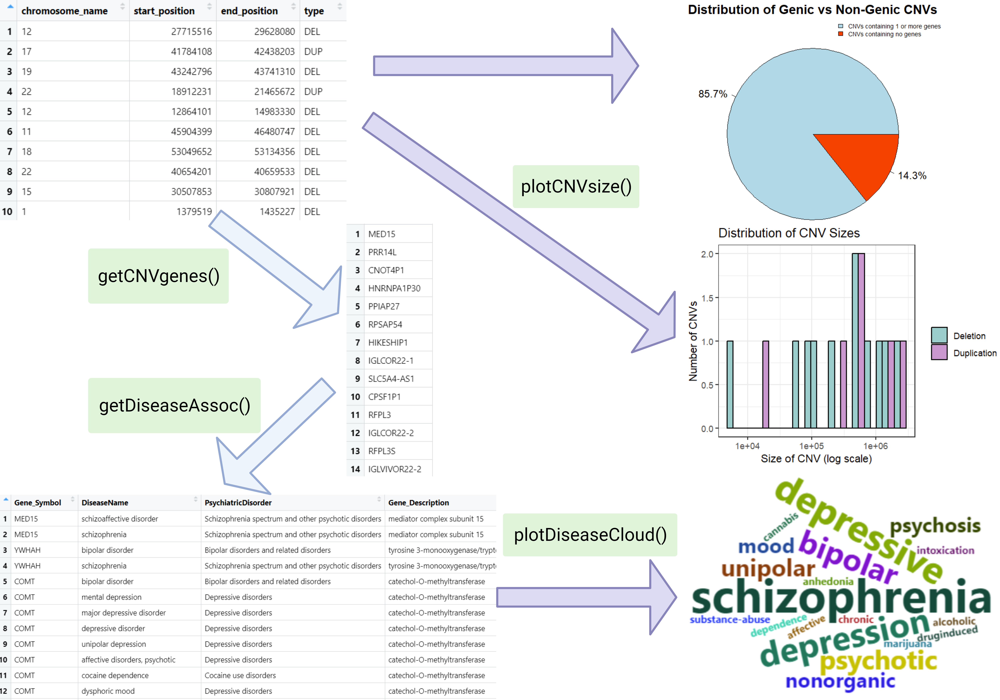

<!-- README.md is generated from README.Rmd. Please edit that file -->

# psychCNVassoc

## Description

<br> `psychCNVassoc` is an R package developed to streamline preliminary
exploratory analysis in psychiatric genetics. It takes Copy Number
Variant (CNV) data as input, identifies genes encompassed by these CNVs,
and associates them with psychiatric disorders from the PsyGeNet
database. While existing packages annotate CNVs with clinical
pathogenicity, evaluate gene dosage sensitivity, and associate
pathogenic CNVs with a broad range of quantitative phenotypes,
psychCNVassoc stands out by focusing exclusively on the association of
CNVs with psychiatric disorders. The package complements existing
workflows by determining whether CNVs warrant further investigation into
the molecular mechanisms underlying their association with psychiatric
disease comorbidities. This package accepts inputs in the format of CNV
calls, which includes the chromosome number, start and end position,
type of variation (deletion or duplication), which can be obtained using
existing CNV detection tools like PennCNV. Additionally, it can accept a
pre-defined list of genes as HGNC symbols (e.g. ‘COMT’, ‘DRD3’, ‘HTR1A’)
for associating genes to diseases. The `psychCNVassoc` package was
developed using `R version 4.3.1 (2023-06-16 ucrt)`,
`Platform: x86_64-w64-mingw32/x64 (64-bit)` and
`Running under: Windows 10 x64 (build 19045)`.

## Installation

<br> <br> To install the latest version of the package:

``` r
install.packages("devtools")
library("devtools")
devtools::install_github("angelauzelac10/psychCNVassoc", build_vignettes = TRUE)
library("psychCNVassoc")
```

To run the Shiny app: Under construction

## Overview

``` r
ls("package:psychCNVassoc")
data(package = "psychCNVassoc") 
browseVignettes("psychCNVassoc")
```

`psychCNVassoc` contains 4 functions.

1.  ***getCNVgenes*** for retrieving a list of genes that are
    encompassed in the provided CNVs.

2.  ***getDiseaseAssoc*** for retrieving a table of gene-disease
    associations.

3.  ***plotCNVsize*** for plotting the distribution of CNV sizes,
    separated by deletion and duplication type CNVs, as a bar plot.

4.  ***plotDiseaseCloud*** for producing a wordcloud of diseases that
    are associated with the list of genes.

The package also contains two example CNV call datasets named
sample_CNV_call and large_CNV_call. Refer to package vignettes for more
details. An overview of the package is illustrated below.



## Contributions

The author of the package is Angela Uzelac. The author wrote the
*getCNVgenes* function which produces a list of genes encompassed within
the CNVs from a provided table. The reference genomes used to annotate
functional genomic regions within the CNVs are retrieved from Ensembl.
Two functions were used from the `biomaRt` package, *useEnsembl* to
connect to the specified genome dataset, and *getBM* to obtain all genes
annotated with their chromosomal location. The `dplyr` package was also
used in this function, *inner_join* was used to join the table of genes
with the table of CNVs, and *filter* was used to select rows in the
joined table where the gene coordinates are within the CNV coordinates.
The author also wrote the function *getDiseaseAssoc* which makes use of
the *psygenetGene* function from the `psygenet2r` package to obtain
gene-disease associations from the provided list of genes. The function
*plotDiseaseCloud* makes use of the `wordcloud2` and `tm` packages to
clean text data, create a term-document matrix, and plot a wordcloud of
the diseases associated with pathogenic CNVs. The function *plotCNVsize*
plots the distribution of CNV sizes, with the code inspired by the
`CNVRS-study` package. The function *plotCNVgeneImpact* (not available
to users) was developed using the generative AI tool ChatGPT (OpenAI,
2023) to aid with graphics setup.

## References

- Wickham H (2016). *ggplot2: Elegant Graphics for Data Analysis*.
  Springer-Verlag New York. <https://ggplot2.tidyverse.org>

- Wickham H, François R, Henry L, Müller K, Vaughan D (2023). *dplyr: A
  Grammar of Data Manipulation*. R package version 1.1.3,
  <https://CRAN.R-project.org/package=dplyr>.

- Lang D, Chien G (2018). *wordcloud2: Create Word Cloud by
  ‘htmlwidget’*. R package version 0.2.1,
  <https://CRAN.R-project.org/package=wordcloud2>.

- Feinerer I, Hornik K (2023). *tm: Text Mining Package*. R package
  version 0.7-11, <https://CRAN.R-project.org/package=tm>.

- Durinck S, Spellman PT, Birney E, Huber W (2009). *Mapping identifiers
  for the integration of genomic datasets with the R/Bioconductor
  package biomaRt*. Nature Protocols 4, 1184-1191 .

- Gutierrez-Sacristan A, Hernandez-Ferrer C, Gonzalez J, Furlong L
  (2023). *psygenet2r: psygenet2r - An R package for querying PsyGeNET
  and to perform comorbidity studies in psychiatric disorders*.
  <doi:10.18129/B9.bioc.psygenet2r>
  <https://doi.org/10.18129/B9.bioc.psygenet2r>, R package version
  1.33.5, <https://bioconductor.org/packages/psygenet2r>.

- BiomaRt Bioconductor R package documentation. (2023). Retrieved
  November 13, 2023, from
  <http://useast.ensembl.org/info/data/biomart/biomart_r_package.html>

- Rul CVd (2019). *How to Generate Word Clouds in R*. Medium.
  <https://towardsdatascience.com/create-a-word-cloud-with-r-bde3e7422e8a>

- Gurbich T, Ilinsky V (2020). *ClassifyCNV: A tool for clinical
  annotation of copy-number variants*. Scientific Reports, 10(1),
  Article 1. <https://doi.org/10.1038/s41598-020-76425-3>

- Merico D, <joseph.r.lugo@gmail.com> RZpbJL (2023). *cnvGSA: Gene Set
  Analysis of (Rare) Copy Number Variants*.
  <doi:10.18129/B9.bioc.cnvGSA>, R package version 1.46.0,
  <https://bioconductor.org/packages/cnvGSA>.

- Silva VHd, Ramos M, Groenen M, Crooijmans R, Johansson A, Regitano L,
  Coutinho L, Zimmer R, Waldron L, Geistlinger L (2020). *CNVRanger:
  association analysis of CNVs with gene expression and quantitative
  phenotypes*. Bioinformatics, 36(3), 972-73.
  <https://doi.org/10.1093/bioinformatics/btz632>.

- OpenAI. (2023, November 7). Code snippet from conversation with
  ChatGPT.

- Du J (2022). *CNVds: Analyzing Human CNVs Based on Dosage Sensitivity
  Scores*. Unpublished. URL <https://github.com/jenydu/CNVds>.

- Du J (2023). *CNVRS-study*. Unpublished. URL
  <https://github.com/jenydu/CNVRS-study>.

- Girdher H (2023). *TDM (Term Document Matrix) and DTM (Document Term
  Matrix)*. Analytics Vidhya.
  <https://medium.com/analytics-vidhya/tdm-term-document-matrix-and-dtm-document-term-matrix-8b07c58957e2>

## Acknowledgements

This package was developed as part of an assessment for 2019-2023
BCB410H: Applied Bioinformatics course at the University of Toronto,
Toronto, CANADA. `psychCNVassoc` welcomes issues, enhancement requests,
and other contributions. To submit an issue, use the [GitHub
issues](https://github.com/angelauzelac10/psychCNVassoc/issues).
