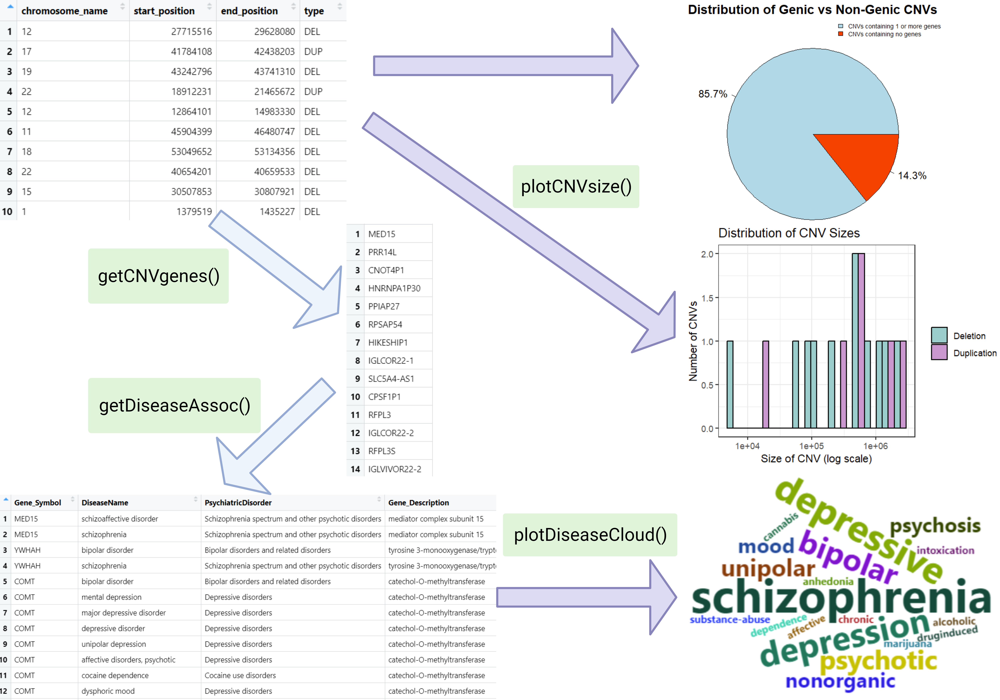

```{r, include = FALSE}
knitr::opts_chunk$set(
  collapse = TRUE,
  comment = "#>"
)
```

```{r setup}
library(psychCNVassoc)
```

## Introduction

`psychCNVassoc` is an R package developed for exploring the impact of pathogenic CNVs on psychiatric disorders. It takes human Copy Number Variant (CNV) data as input, identifies genes encompassed by these CNVs, and associates them with psychiatric disorders from the PsyGeNet database. It is intended for preliminary investigation of how CNVs affect gene expression levels and to see whether the change in copy number of certain genes affect crucial pathways involved in psychiatric disease comorbidities. This package accepts inputs in the format of CNV calls, which includes the chromosome number, start and end position, and type of variation (deletion or duplication), which can be obtained using existing CNV detection tools like PennCNV. Additionally, it can accept a pre-defined list of genes as HGNC symbols (e.g. ‘COMT’, ‘DRD3’, 'HTR1A') for associating genes to diseases.  

This package is developed for BCB410H: Applied Bioinformatics at the University of Toronto, Canada. This document gives a tour of psychCNVassoc. It was written in R Markdown, using the [knitr](https://cran.r-project.org/package=knitr) package for production. See help(package = "psychCNVassoc") for further details.

See `help(package = "psychCNVassoc")` for further details and references provided by `citation("psychCNVassoc")`. 


To download **psychCNVassoc**, use the following commands:

```{r, eval = FALSE}
install.packages("devtools")
library("devtools")
devtools::install_github("angelauzelac10/psychCNVassoc", build_vignettes = TRUE)
library("psychCNVassoc")
```

To list all functions available in the package:

```{r, eval = FALSE}
ls("package:psychCNVassoc")
```

To list all sample datasets available in the package:

```{r, eval = FALSE}
data(package = "psychCNVassoc")
```

To run the Shiny app:
```{r, eval = FALSE}
runPsychCNVassoc()
```


## Components

<div style="text-align:center">

## Sample Usage

### 1. Load the data and visualize

The first step of using this package is obtaining human CNV data in the form of a CNV call. This should be a dataframe containing the columns: chromosome name (1-22, X, or Y), start position (base pair location), end position (base pair location), and type (indicating DEL for deletion or DUP for duplication). This can be done by obtaining existing data, for example from the package RTCGA.CNV, or by performing CNV calling on human genotype data using tools such as PennCNV or QuantiSNP. Using this dataset, users can determine which genes are found in the CNVs, and ultimately analyze the impact that the changes in gene expression levels might have on psychiatric conditions.

In this package, a sample CNV call is provided. This dataset contains a subset of a CNV call with 21 CNVs described by 4 fields: chromosome name, start and end position, and type. The CNV calling was done on Homo sapiens genotype data using genome build hg19 and contain autosomes 1-5, 6, 11-3, 15, 17-19, 22, and sex chromosome X. See `?sample_CNV_call` for more information and references. 

To load the CNV regions from sample_CNV_call.rda, provided in the /data folder:

```{r error = FALSE, warning = FALSE}
cnv_data <- sample_CNV_call
head(cnv_data)
```


Users can view a summary of this data by plotting the distribution of CNVs by size across all chromosomes or a specified chromosome. See `?plotCNVsize` for more information and references.

To plot the size distribution of CNVs from the sample dataset:

```{r error = FALSE, warning = FALSE, message = FALSE, fig.width = 8}
psychCNVassoc::plotCNVsize(cnv_data)
```

To plot the size distribution of provided CNVs for a specific chromosome:

```{r error = FALSE, warning = FALSE, message = FALSE, fig.width = 8}
psychCNVassoc::plotCNVsize(cnv_data, chromosome_number = "17")
```

The x-axis represents the range of CNV sizes measured by the number of base pairs, displayed on a logarithmic scale. The y-axis indicates the frequency of each CNV size within the dataset, represented by the count of CNVs that correspond to each size (number of base pairs). The dataset is also split by the type of CNV so that users can visualize the number of deletion CNVs vs the number of duplication CNVs.


### 2. Obtain list of gene impacted by copy number variation

The next step is to retrieve a list of genes that are affected by the provided CNVs. This is done by determining which genes' locations are encompassed within genomic regions that are duplicated or deleted. The result is a vector of HGNC symbols. The function `getCNVgenes` is used to obtain this list. Furthermore, users can choose to visualize the distribution of genic CNVs by setting the `show_piechart` parameter. See `?getCNVgenes` for more information, examples, and references.

To obtain all the genes that are found in the provided CNVs and visualize the distribution of genic vs non-genic CNVs:

```{r error = FALSE, warning = FALSE, fig.width = 8}
result <- psychCNVassoc::getCNVgenes(cnv_data, show_piechart = TRUE)
gene_list <- result$gene_list
head(gene_list)
```


### 3. Determine diseases impacted by changes in gene expression levels

The final goal of this package is to determine which psychiatric conditions could potentially be caused by changes in copy number of their associated genes. The function `getDiseaseAssoc` is used to query the PsyGeNet database using the previously obtained list of genes. See `?getDiseaseAssoc` for more information, examples, and references.

To obtain a gene-disease association table from the obtained list of genes encompassed by CNVs:

```{r error = FALSE, warning = FALSE}
gene_disease_assoc <- psychCNVassoc::getDiseaseAssoc(gene_list)
head(gene_disease_assoc)
```

This function returns a dataframe containing a variety of information regarding the gene-disease association, including the gene symbol, gene description, disease name, psychiatric disorder, and number of abstracts that identify this relationship. 


### 4. Visualize results 

The highlight of this package is the visualization of the most commonly observed disorders and most common genes in the gene-disease association table. This representation is particularly beneficial for users as it reveals potential links between diseases and variations in copy number. Identifying these associations paves the way for deeper exploration into the molecular mechanisms underlying such conditions, ultimately contributing to a better understanding of their development and progression. The frequency of diseases is displayed as a wordcloud using the `plotDiseaseCloud` function, and the frequency of genes is displayed as a wordcloud using the `plotGeneCloud` function. In these wordclouds, the larger a word is displayed, the more frequently it appears in the gene-disease association table. See `?plotDiseaseCloud` and `?plotGeneCloud` for more information, examples, and references.


To visualize which psychiatric disorders are associated with the list of genes, create a wordcloud using:

```{r error = FALSE, warning = FALSE, fig.width = 8}
dwc_result <- psychCNVassoc::plotDiseaseCloud(gene_disease_assoc)
dwc_result$wordcloud
```


Since the PsyGeNet database contains gene annotations for some diseases more than others, the results may be biased. Therefore, users can choose to eliminate highly dominant terms to allow viewing of other important terms. For example, the database has a greater number of gene annotations for schizophrenia, and since this is the largest term in the first iteration of the wordcloud (above), users can eliminate it as follows:

```{r error = FALSE, warning = FALSE, fig.width = 8}
dwc2_result <- psychCNVassoc::plotDiseaseCloud(gene_disease_assoc, remove_most_freq = 1)
dwc2_result$wordcloud
```


To visualize which genes are commonly associated with psychiatric disorders, create a wordcloud using:

```{r error = FALSE, warning = FALSE, fig.width = 8}
gwc_result <- psychCNVassoc::plotGeneCloud(gene_disease_assoc)
gwc_result$wordcloud
```


## Package References

Uzelac, A. (2023) psychCNVassoc: Determining the Association Between Copy Number
Variants and Psychiatric Disorders.  Unpublished. URL
<https://github.com/angelauzelac10/psychCNVassoc>.


## References

- R Core Team (2023). _R: A Language and Environment for Statistical Computing_. R Foundation for Statistical Computing, Vienna, Austria. <https://www.R-project.org/>.

- Wickham H (2016). _ggplot2: Elegant Graphics for Data Analysis_. Springer-Verlag New York. <https://ggplot2.tidyverse.org>

- Wickham H, François R, Henry L, Müller K, Vaughan D (2023). _dplyr: A Grammar of Data Manipulation_. R package version 1.1.3, <https://CRAN.R-project.org/package=dplyr>.

- Lang D, Chien G (2018). _wordcloud2: Create Word Cloud by 'htmlwidget'_. R package version 0.2.1, <https://CRAN.R-project.org/package=wordcloud2>.

- Feinerer I, Hornik K (2023). _tm: Text Mining Package_. R package version 0.7-11, <https://CRAN.R-project.org/package=tm>.

- Durinck S, Spellman PT, Birney E, Huber W (2009). _Mapping identifiers for the integration of genomic datasets with the R/Bioconductor package biomaRt_. Nature Protocols 4, 1184-1191 .

- Gutierrez-Sacristan A, Hernandez-Ferrer C, Gonzalez J, Furlong L (2023). _psygenet2r: psygenet2r - An R package for querying PsyGeNET and to perform comorbidity studies in psychiatric disorders_. doi:10.18129/B9.bioc.psygenet2r <https://doi.org/10.18129/B9.bioc.psygenet2r>, R package version 1.33.5, <https://bioconductor.org/packages/psygenet2r>.

- BiomaRt Bioconductor R package documentation. (2023). Retrieved November 13, 2023, from <http://useast.ensembl.org/info/data/biomart/biomart_r_package.html>

- Rul CVd (2019). _How to Generate Word Clouds in R_. Medium. <https://towardsdatascience.com/create-a-word-cloud-with-r-bde3e7422e8a>

- Gurbich T, Ilinsky V (2020). _ClassifyCNV: A tool for clinical annotation of copy-number variants_. Scientific Reports, 10(1), Article 1. <https://doi.org/10.1038/s41598-020-76425-3>

- Merico D, <joseph.r.lugo@gmail.com> RZpbJL (2023). _cnvGSA: Gene Set Analysis of (Rare) Copy Number Variants_. doi:10.18129/B9.bioc.cnvGSA, R package version 1.46.0, <https://bioconductor.org/packages/cnvGSA>.

- Silva VHd, Ramos M, Groenen M, Crooijmans R, Johansson A, Regitano L, Coutinho L, Zimmer R, Waldron L, Geistlinger L (2020). _CNVRanger: association analysis of CNVs with gene expression and quantitative phenotypes_. Bioinformatics, 36(3), 972-73. <https://doi.org/10.1093/bioinformatics/btz632>.

- OpenAI. (2023, November 7). Code snippet from conversation with ChatGPT.

- Du J (2022). _CNVds: Analyzing Human CNVs Based on Dosage Sensitivity Scores_. Unpublished. URL <https://github.com/jenydu/CNVds>.
  
- Du J (2023). _CNVRS-study_. Unpublished. URL <https://github.com/jenydu/CNVRS-study>.

- Girdher H (2023). _TDM (Term Document Matrix) and DTM (Document Term Matrix)_. Analytics Vidhya. <https://medium.com/analytics-vidhya/tdm-term-document-matrix-and-dtm-document-term-matrix-8b07c58957e2>

- BioRender (2023). Image created by Uzelac, A. Retrieved November 13, 2023, from <https://app.biorender.com/>

-  Kosinski M (2023). _RTCGA: The Cancer Genome Atlas Data Integration_. doi:10.18129/B9.bioc.RTCGA <https://doi.org/10.18129/B9.bioc.RTCGA>, R package version 1.31.0, <https://bioconductor.org/packages/RTCGA>.

- Chang W, Cheng J, Allaire J, Sievert C, Schloerke B, Xie Y, Allen J, McPherson J, Dipert A, Borges B (2023). _shiny: Web Application Framework for R_. R package version 1.7.5.1, <https://CRAN.R-project.org/package=shiny>.


------------------------------------------------------------------------


```{r}
sessionInfo()
```


